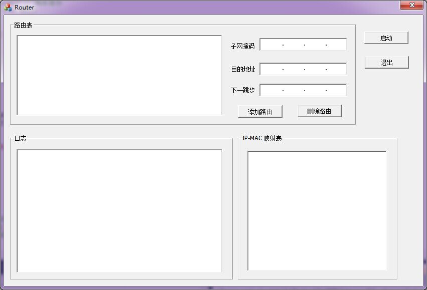

#Router
---
A simple router based on `winpcap`.

There are two editions, both are on `windows`:

1. Router: a `codeblocks` project, depend on `pthread` and `winpcap` of windows.
2. Router_MFC: a `visual studio 2010` MFC project, depend on `winpcap`.

##Functions
Route and forward IP datagram, send ICMP packet, connect two subnets(ping).

Route table and IP-MAC mapping table included!

Handle with `ICMP/IP/ARP` Protocol.